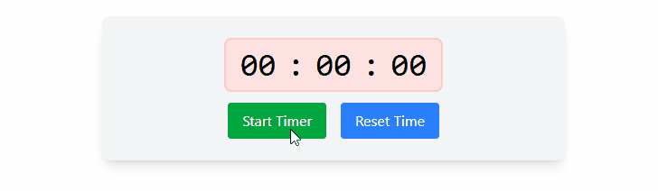

# ⏱️ React Timer

A minimal, accessible timer/stopwatch built with React.  
Great for practice projects, course exercises, and quick demos.

## 🚀 Features

- ▶️ Start / ⏸️ Pause / ⏹️ Reset

## Preview

Here's an animated preview of how the application works:

